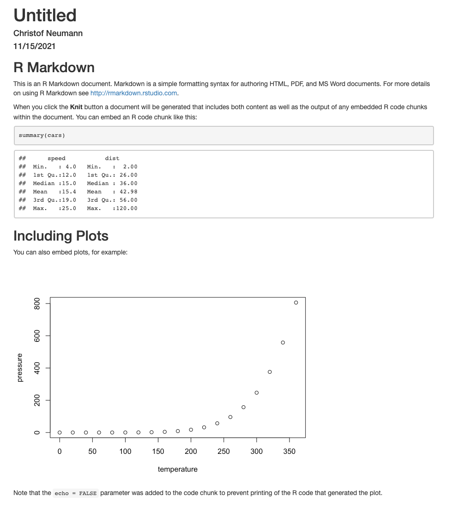

Dear all,

In order to prepare the workshop during the RTG conference I would like to ask you for two things. First, please fill out this survey (https://www.surveymonkey.de/r/MVMPJYD). There are eight questions and it shouldn't take more than 3 minutes to fill. Note that this is meant informally and if you feel like not answering or not understanding any of the questions just don't provide a response.

The second point relates to the practical part of the workshop and I just want to make sure that your computers are set up to run the examples. In other words, in order to participate in the practical part of the workshop your computer needs to meet some minimal requirements. First, please have available a fairly recent version of R (> v4.0, https://cran.r-project.org/).

Second, the simplest way of following (and reproducing...) the examples during the workshop is to install and use RStudio (https://www.rstudio.com/). Also, here a fairly recent version is needed (> v1.0). If you don't remember the last time you updated RStudio, then this might be the occasion to update for the sake of the workshop.

In terms of other packages, you need at least the following, the installation of which should work out without much fuss in most cases (and I'd suspect many of you have them already available anyway):

```{r, eval=FALSE}
install.packages("rmarkdown")
install.packages("markdown")
```


Once you've done this, you can test whether this worked with the following steps:

1) in RStudio: select File>New File>R Markdown...
2) click: OK (leave all settings at their defaults)
3) save the .Rmd file that you just created somewhere (but leave it open in RStudio)
4) look for and click the blueish 'knit' button in RStudio (or better even, use the keyboard shortcut ctrl+shift+K (Windows) or cmd+shift+K (MacOS))

All is good and you are ready if RStudio opens a new window (or a new page appears in your web browser) that contains some text, a table and a plot, something like this:

```{r, echo=FALSE, out.width="20%", fig.align='center'}

```


If that didn't work, please get in touch with me so we can figure out what went wrong. Also, if for some reason you don't want to or cannot use RStudio let me know so we can get you set up nevertheless.


Cheers and see you on Thursday

Christof

